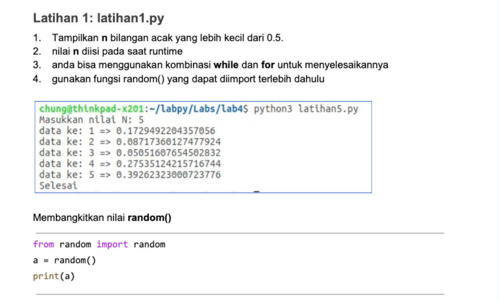
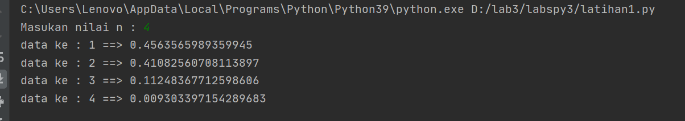
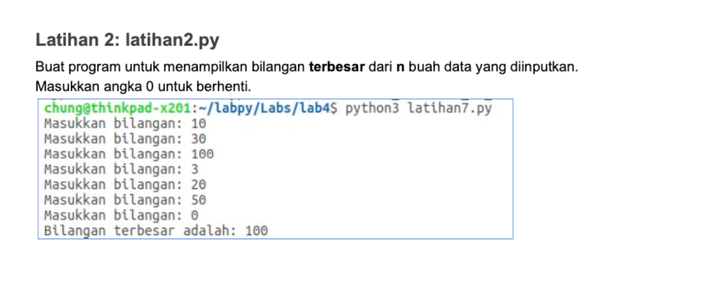
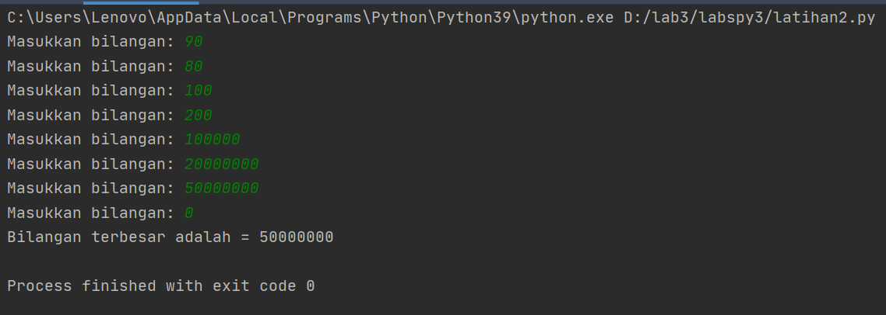
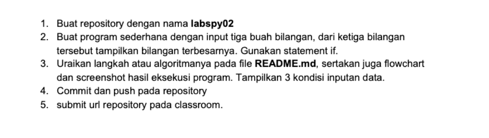
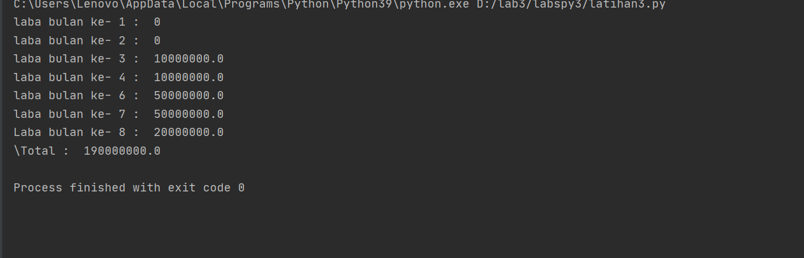

# labspy3
# Modul Praktikum 3
# Latihan 1

import random
nilai = int(input('Masukan nilai n : '))
a = 0
for x in range (nilai):
    i = random.uniform(.0,.5)
    a+=1
    print('data ke :',a,'==>', i)
Penjelasan:

import random berfungsi untuk memanggil library random, dimana random berfungsi untuk menentukan pilihan secara acak
nilai = int(input('Masukan nilai n : ')) untuk menginputkan nilai berupa integer
range() berfungsi menghasilkan list
masukkan i = random.uniform (.0,.5) di gunakan untuk menampilkan bilangan float random, lalu masukkan a+=1 untuk memberi nomer pada bilangan float.
print('data ke :',a,'==>', i) untuk menampilkan output data
Output:

# Latihan 2

max = 0
while True:
    a=int(input('Masukkan bilangan: '))
    if max < a :
        max = a
    if a == 0:
        break
print('Bilangan terbesar adalah =', max)
Penjelasan:

Integer max = 0

fungsi perulangan while true hingga menampilkan perulangan sampai batas tertentu.

Memasukan bilangan integer pada "a"

Menggunakan fungsi if jika max kurang dari nilai a, maka max sama dengan a

Mengunakan fungsi if jika nilai a adalah 0 maka fungsi break artinya perulangan berhenti jika menulis nilai 0

Mencetak nilai paling terbesar setelah break, sehingga menampilkan nilai terbesar diantara bilangan tersebut dalam perulangan.

Output:

# Tugas Praktikum 3

a = 100000000
for x in range (1,9):
    if (x>=1 and x<=2):
        b=a*0
        print("laba bulan ke-",x,": ",b)
    if (x>=3 and x<=4):
        c=a*0.1
        print("laba bulan ke-",x,": ",c)
    if (x>5 and x<=7):
        d=a*0.5
        print ("laba bulan ke-",x,": ",d)
    if (x==8):
        e=a*0.2
        print("Laba bulan ke-",x,": ",e)
total=b+b+c+c+d+d+d+e
print("\Total : ",total)
Penjelasan:

Variabel a = 100.000.000 modal awal

Menggunakan fungsi looping for pada nilai x 1-9 untuk menampilkan bulan 1 sampai bulan 8.

Menggunakan fungsi if, untuk menghitung laba bulan 1 sampai 8

Bulan pertama dan kedua laba adalah 0

Bulan ke 3 dan ke 4 mendapat laba 1% sehingga modal di kali 1% = keuntungan

Bulan ke 5 mendapatkan laba 5%, sehingga modal dikali 5% = keuntungan

Bulan ke 8 mendapatkan laba 2% sehingga keuntungan menurun dari bulan sebelumnya, modal dikali 2% = keuntungan.

Menghitung jumlah total laba dengan menjumlah keuntungan dari bulan ke 1 sampai bulan 8, hasilnya adalah total keuntungan yang didapat total=b+b+c+c+d+d+d+e

print("\Total : ",total), untuk menampilkan hasil keseluruhan laba dari bulan pertama sampai bulan kedelapan.

Output:

# Terimakasih